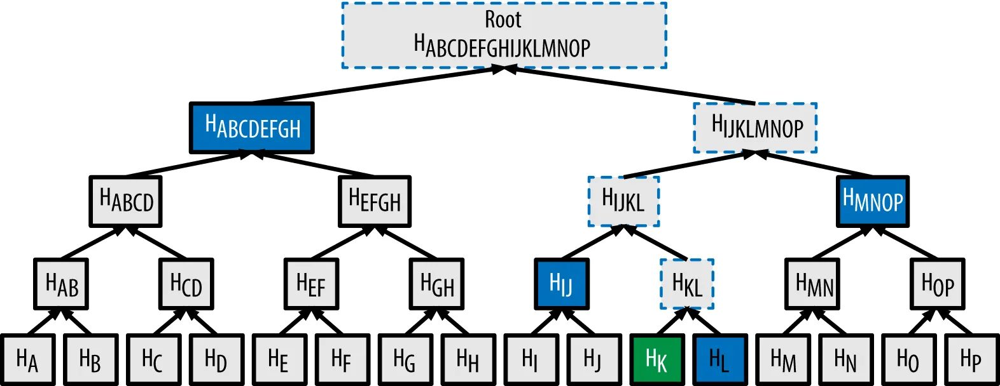

# Rusty Merkle Tree

### Merkle Proof of Inclusion
Merkle proofs are used to decide upon the following factors:

- If the data belongs in the merkle tree
- To concisely prove the validity of data being part of a dataset without storing the whole data set
- To ensure the validity of a certain data set being inclusive in a larger data set without revealing either the complete data set or its subset.

In order to verify the inclusion of data [K], in the merkle tree root, we use a one way function to hash [K] to obtain H(K).
In order to obtain a merkle proof of H, we need H(L), H(IJ), H(MNOP) and H(ABCDEFGH) with which we can together obtain H(ABCDEFHGIJKLMNOP) hence proving that H(K) was part of the merkle tree implying that data set K was indeed part of the universal dataset [A, B, C, … , N, O, P].
